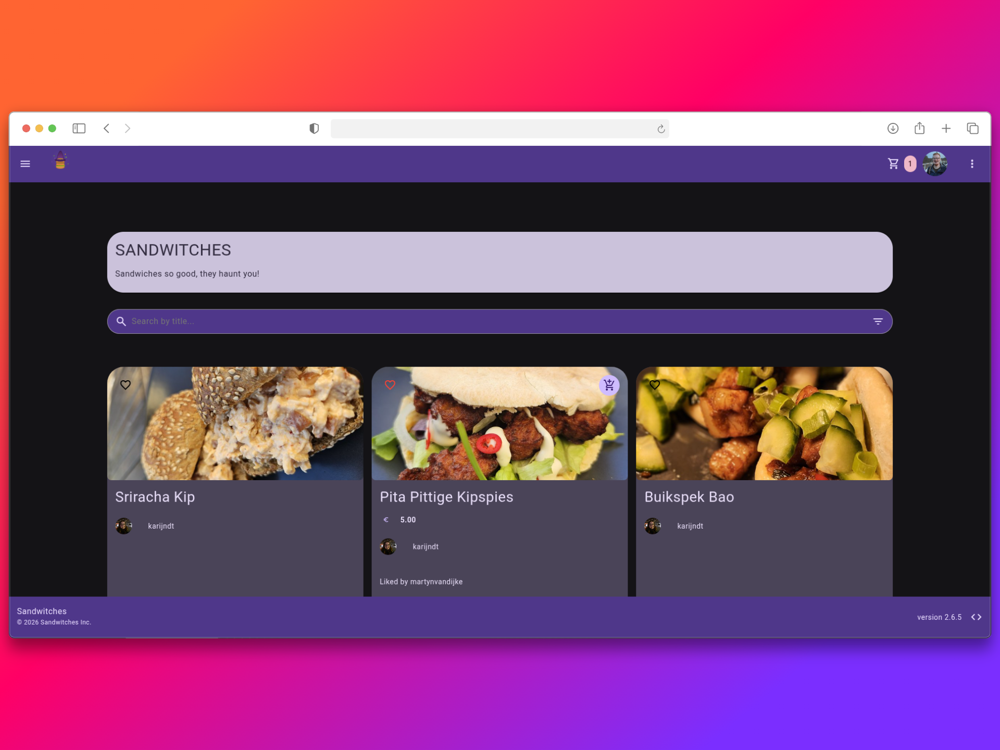

<p align="center">
  
</p>

<h1 align="center">🥪 Sandwitches</h1>

<p align="center">
  <strong>Sandwiches so good, they haunt you!</strong>
</p>

<p align="center">
  <a href="https://github.com/martynvdijke/sandwitches/actions/workflows/ci.yaml">
    
  </a>
  <a href="https://github.com/martynvdijke/sandwitches/blob/main/LICENSE">
    
  </a>
  
  
  <a href="https://github.com/astral-sh/ruff">
    
  </a>
</p>

---

## ✨ Overview

Sandwitches is a modern, recipe management platform built with **Django**.
It is made as a hobby project for my girlfriend, who likes to make what I call "fancy" sandwiches (sandwiches that go beyond the Dutch normals), lucky to be me :).
Sandwiches so good you will think they are haunted !.
See wanted to have a way to advertise and share those sandwiches with the family and so I started coding making it happen, in the hopes of getting more fancy sandwiches.



## 🎯 Features

Sandwitches comes packed with comprehensive features for recipe management, community engagement, and ordering:

- **🍞 Recipe Management** - Upload and create sandwich recipes with images, ingredients, and instructions
- **👥 Community Page** - Discover and browse sandwiches shared by community members
- **🛒 Ordering System** - Browse recipes and place orders with cart functionality and order tracking
- **⭐ Ratings & Reviews** - Rate recipes on a 0-10 scale with detailed comments
- **🔌 REST API** - Full API access for recipes, tags, ratings, orders, and user management
- **📊 Admin Dashboard** - Comprehensive admin interface for recipe approval and site management
- **🌍 Multi-language Support** - Internationalization for multiple languages
- **📱 Responsive Design** - Mobile-friendly interface with BeerCSS framework
- **🔔 Notifications** - Email and Gotify push notification integration
- **📈 Order Tracking** - Real-time order status tracking with unique tracking tokens

## 📥 Getting Started

### Prerequisites

- Python 3.12+
- [uv](https://github.com/astral-sh/uv) (recommended) or pip

### Installation

1. **Clone the repository**:

    ```bash
    git clone https://github.com/martynvdijke/sandwitches.git
    cd sandwitches
    ```

2. **Sync dependencies**:

    ```bash
    uv sync
    ```

3. **Run migrations and collect static files**:

    ```bash
    uv run invoke setup-ci  # Sets up environment variables
    uv run src/manage.py migrate
    uv run src/manage.py collectstatic --noinput
    ```

4. **Start the development server**:

    ```bash
    uv run src/manage.py runserver
    ```

## 🧪 Testing & Quality

The project maintains high standards with over **80+ automated tests**.

- **Run tests**: `uv run invoke tests`
- **Linting**: `uv run invoke linting`
- **Type checking**: `uv run invoke typecheck`

---

<p align="center">
  Made with ❤️ for sandwich enthusiasts.
</p>
