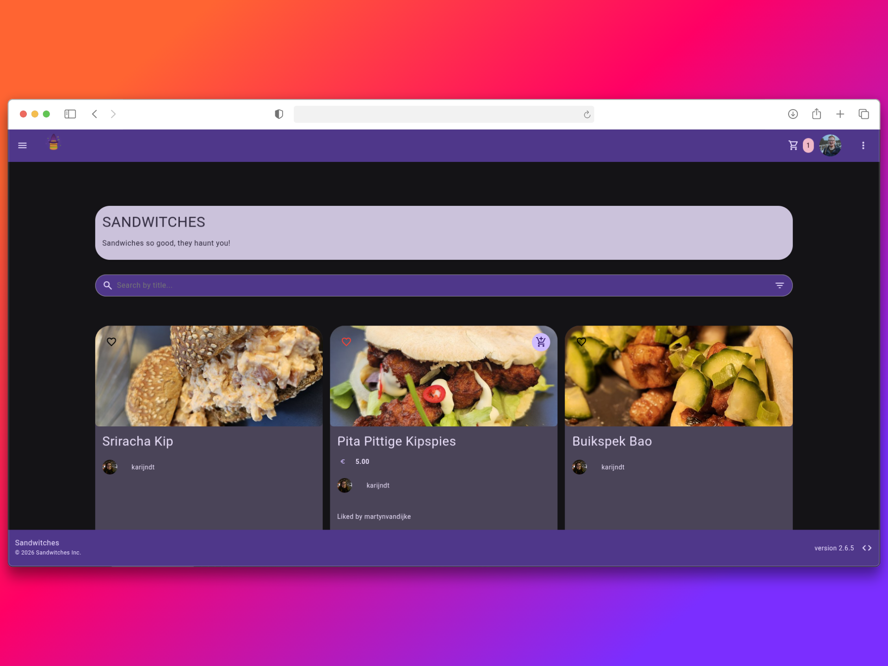

<p align="center">
  
</p>

<h1 align="center">🥪 Sandwitches</h1>

<p align="center">
  <strong>Sandwiches so good, they haunt you!</strong>
</p>

<p align="center">
  <a href="https://github.com/martynvdijke/sandwitches/actions/workflows/ci.yaml">
    
  </a>
  <a href="https://github.com/martynvdijke/sandwitches/blob/main/LICENSE">
    
  </a>
  
  
</p>

- [✨ Overview](#-overview)
- [🎯 Features](#-features)
  - [TRMNL](#trmnl)
- [📥 Getting Started](#-getting-started)
  - [Environment variables](#environment-variables)
- [Development setup](#development-setup)
  - [Prerequisites](#prerequisites)
  - [Installation](#installation)
- [🧪 Testing & Quality](#-testing--quality)

---

## ✨ Overview

Sandwitches is a modern, recipe management platform built with **Go** (Gin, GORM, SQLite, HTMX).
It is made as a hobby project for my girlfriend, who likes to make what I call "fancy" sandwiches (sandwiches that go beyond the Dutch normals), lucky to be me :).
Sandwiches so good you will think they are haunted !.
She wanted to have a way to advertise and share those sandwiches with the family and so I started coding making it happen, in the hopes of getting more fancy sandwiches.

To view the live website go to [sandwitches.vandijke.xyz](https://sandwitches.vandijke.xyz)



## 🎯 Features

Sandwitches comes packed with comprehensive features for recipe management, community engagement, and ordering:

- **🍞 Recipe Management** - Upload and create sandwich recipes with images, ingredients, and instructions
- **👥 Community Page** - Discover and browse sandwiches shared by community members
- **🛒 Ordering System** - Browse recipes and place orders with cart functionality and order tracking
- **⭐ Ratings & Reviews** - Rate recipes on a 1-5 scale with detailed comments
- **🔌 REST API** - Full API access for recipes, tags, ratings, orders, and user management
- **📊 Admin Dashboard** - Comprehensive admin interface for recipe approval and site management
- **🌍 Multi-language Support** - Internationalization for multiple languages
- **📱 Responsive Design** - Mobile-friendly interface with BeerCSS framework
- **🖨️ E-Ink Mode** - High-contrast theme plus a step-by-step cooking mode for e-ink displays
- **🔔 Notifications** - Email and Gotify push notification integration
- **📈 Order Tracking** - Real-time order status tracking with unique tracking tokens
- **📊 Analytics** - Umami analytics integration for tracking user behavior
- **🖨️ TRMNL** - Official [TRMNL](https://trmnl.com/) plugin support (templates in `trmnl/`)

### TRMNL

If you happen to have a TRMNL lying around be sure to check out this [recipe](https://trmnl.com/recipes/247547) which is an official plugin for your TRMNL. The Liquid templates live in the [`trmnl/`](./trmnl/) directory and poll the `/api/v1/recipe-of-the-day` and `/api/v1/users` endpoints.

## 📥 Getting Started

```bash
services:
  sandwitches:
    image: martynvandijke/sandwitches:latest
    container_name: sandwitches
    environment:
     - ALLOWED_HOSTS=localhost,127.0.0.1,[::1]
     - CSRF_TRUSTED_ORIGINS=http://localhost:6270,http://127.0.0.1:6270
     - SECRET_KEY=superdupersecretkey
     - DATABASE_FILE=/config/db.sqlite3
     - MEDIA_ROOT=/config/media
    ports:
      - 6270:6270
    healthcheck:
      test: ["CMD", "curl", "-f", "http://localhost:6270/api/v1/ping"]
      interval: 5s
      timeout: 10s
      retries: 3
    volumes:
      - /path/to/sandwitches:/config
    restart: always
```

### Environment variables

Below is a list of all supported environment variables.

| **Variable**         | **Required** | **Description**                                                                       |
| -------------------- | ------------ | ------------------------------------------------------------------------------------- |
| SECRET_KEY           | Yes          | A unique, secret value used for cryptographic signing and session security.           |
| ALLOWED_HOSTS        | Yes          | A list of strings representing the host/domain names that this server can serve.      |
| CSRF_TRUSTED_ORIGINS | Yes          | A list of trusted origins for safe cross-site requests (e.g., <https://example.com>). |
| DATABASE_FILE        | No           | The file path to the SQLite database (default `db.sqlite3`).                          |
| MEDIA_ROOT           | No           | The filesystem path to the directory that holds user-uploaded files (default `media`).|
| DEBUG                | No           | Boolean to enable debug mode (default `false`).                                       |
| PORT                 | No           | The port the server listens on (default `6270`).                                      |
| LANGUAGE_CODE        | No           | Default language code (default `en`).                                                 |
| Django_DB_PATH       | No           | Path to an existing Django SQLite DB to auto-migrate data from on first boot.         |
| SEND_EMAIL           | No           | Boolean to enable email notifications.                                                |
| SMTP_USE_TLS         | No           | Boolean (True/False) to enable/disable TLS encryption for outgoing emails.            |
| SMTP_HOST            | No           | The hostname or IP address of the mail server used to send emails.                    |
| SMTP_PORT            | No           | The port number to use for the SMTP server (usually 587 for TLS or 465 for SSL).      |
| SMTP_FROM_NAME       | No           | The display name that appears in the "From" field of outgoing emails.                 |
| SMTP_FROM_EMAIL      | No           | The actual email address used as the sender for system-generated messages.            |
| SMTP_USER            | No           | The username required to authenticate with the SMTP server.                           |
| SMTP_PASSWORD        | No           | The password required to authenticate with the SMTP server.                           |
| GOTIFY_URL           | No           | The base URL of your Gotify server instance for push notifications.                   |
| GOTIFY_TOKEN         | No           | The application-specific token used to authenticate with Gotify.                      |
| UMAMI_HOST           | No           | UMAMI analytics tracking host.                                                        |
| UMAMI_WEBSITE_ID     | No           | UMAMI analytics website id.                                                           |

## Development setup

### Prerequisites

- Go 1.26+
- Node.js 24+ (for the webpack frontend build)
- Python 3.13+ with [uv](https://github.com/astral-sh/uv) (for the Playwright UI test suite)
- [Task](https://taskfile.dev/) (optional, wraps common commands)

### Installation

1. **Clone the repository**:

    ```bash
    git clone https://github.com/martynvdijke/sandwitches.git
    cd sandwitches
    ```

2. **Install dependencies and build the frontend**:

    ```bash
    cd go-app
    go mod download
    cd .. && npm install
    npm run build   # builds static assets into go-app/static/dist
    ```

3. **Run the server**:

    ```bash
    cd go-app
    go run .        # or: task dev (hot reload via air)
    ```

The server listens on port 6270 and the first visit to `/setup` bootstraps the admin account.

## 🧪 Testing & Quality

- **Go unit tests**: `cd go-app && go test ./...`
- **Go linting**: `cd go-app && go vet ./...`
- **UI tests (Playwright)**: `uv sync --dev && uv run playwright install chromium && uv run pytest tests_go`

---

<p align="center">
  Made with ❤️ for sandwich enthusiasts.
</p>
